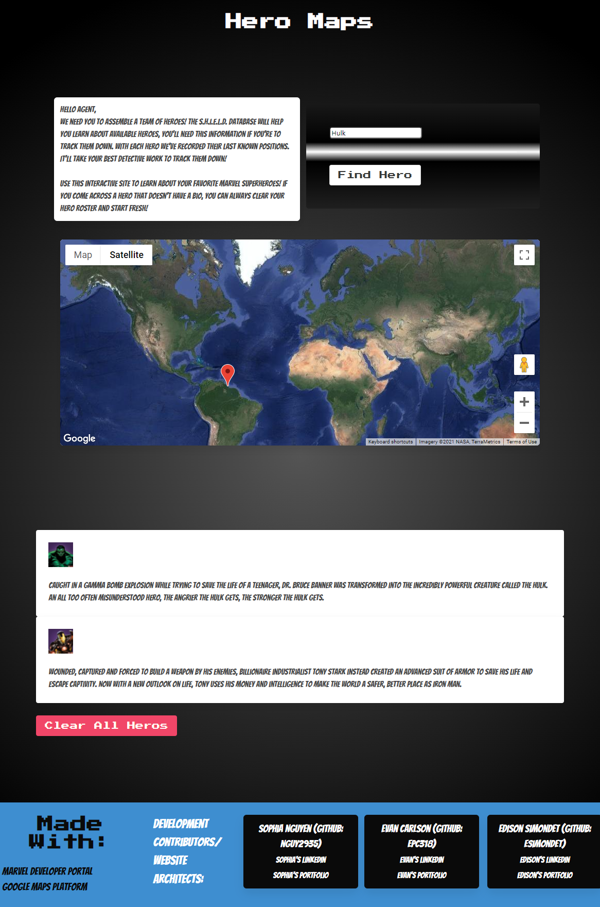

## Front End Project
Hero Maps

## Purpose

## Description
An interactive webpage that allows the user build a unique team of heroes and delivers a list of information about them including last known locatoin, place of origin, powers, etc.

## Built With
 * HTML
 * JavaScript
 * CSS

## Third Party Libraries
* Marvel API
* Google Maps API

## Website
You can view the live deployment [HERE](https://esimondet.github.io/front-end-project/)

## Screenshot of landing page

## Contribution
 * Edison Simondet (github: esimondet)
 * Sophia Nguyen (github: nguy2935)
 * Evan Carlson (github: epc318)